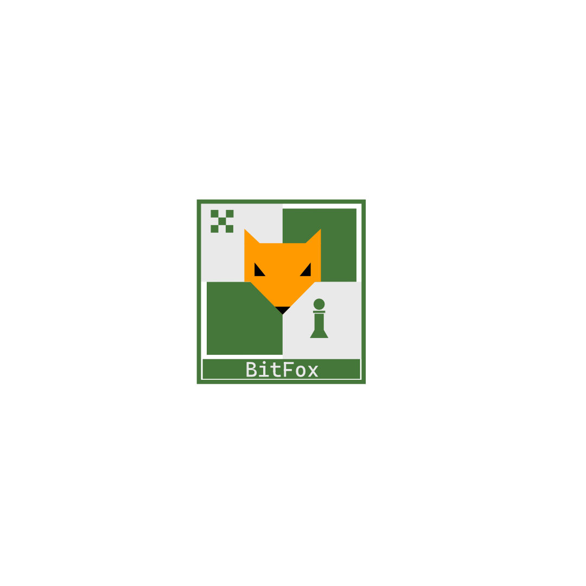
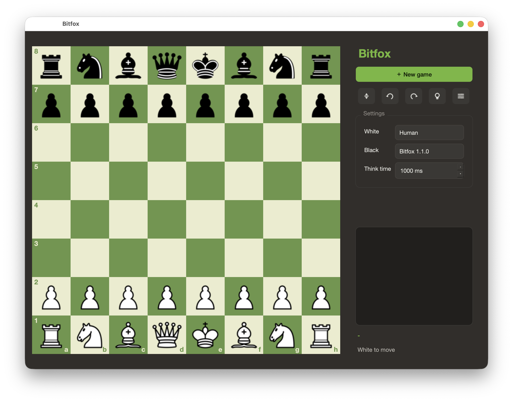

# Bitfox

<p align="center">
  
</p>

[](LICENSE)


A UCI chess engine written in Rust. It uses a bitboard board, alpha-beta search,
and an NNUE evaluation trained from its own self-play data. The same crate also
builds a shared library used by the desktop board.

<p align="center">
  
</p>

## Status

The engine currently has:

- Bitboard board representation with magic-bitboard sliders, incremental Zobrist
  keys, make/unmake, SEE, and threat-square generation.
- Staged, legal move generation, perft-verified against the standard positions
  (startpos, Kiwipete, positions 3-6).
- Search with iterative deepening, aspiration windows, principal variation
  search, quiescence, a shared atomic transposition table, pruning/reduction
  heuristics, and LazySMP multi-threading.
- NNUE evaluation: a king-bucketed, side-to-move-relative network with an
  incremental accumulator and NEON SIMD on Apple Silicon, with a classical
  PSQT evaluator kept as a reference.

Ongoing work is strength tuning: larger networks, more and better training data,
and search-parameter refinement.

## Strength

Strength changes are checked with node-limited self-play
(`tools/selfplay.py`) and an SPRT stop. For a rough external reference, Bitfox
is also tested against Stockfish at fixed `UCI_Elo` levels under fast time
controls. Public CCRL/CEGT ratings are not part of the release process yet.

## Build

Requires Rust stable (>= 1.85).

```sh
make release          # cargo build --release in engine/
```

Or directly:

```sh
cd engine && cargo build --release
```

The optimized binary is written to `engine/target/release/bitfox`. The same
build also produces a `cdylib` (`libbitfox.dylib`/`.so`/`.dll`) used by the GUI.

## Repository layout

```
.
├── engine/                 Rust UCI engine (binary + cdylib)
│   ├── src/
│   │   ├── types/          squares, pieces, moves, bitboards, scores, castling
│   │   ├── board/          state, FEN, make/unmake, Zobrist, SEE, threats
│   │   ├── movegen/         staged legal move generation, magic tables
│   │   ├── search/          iterative deepening, negamax, quiescence,
│   │   │                    ordering, histories, correction history, time
│   │   ├── eval/            NNUE inference, classical PSQT, embedded network
│   │   ├── tools/           perft, bench, datagen subcommands
│   │   ├── tt.rs            shared atomic transposition table
│   │   ├── uci.rs           UCI protocol loop
│   │   ├── ffi.rs           cc_* C ABI consumed by the GUI
│   │   ├── lib.rs           library crate root
│   │   └── main.rs          binary entry point
│   ├── tests/              perft, see, eval, nnue suites
│   └── Cargo.toml
├── gui-qt/                 Qt 6 desktop board and UCI engine launcher
├── trainer/                NNUE training (Bullet) and the text->bulletformat converter
├── tools/                  selfplay.py strength gate
├── data/openings/          opening positions used by self-play
├── docs/                   architecture, engine, performance, roadmap notes
└── Makefile
```

## Architecture

A conventional alpha-beta engine on a bitboard core, evaluated with NNUE.

- **Board.** Pieces are tracked as 64-bit bitboards, one per piece type and two
  per color, with a mailbox, incremental Zobrist keys (full, pawn, and a
  non-pawn key per color), and make/unmake with an undo stack.
- **Sliders.** Bishop, rook, and queen attacks use magic bitboards backed by
  precomputed tables (`movegen/magic.rs`).
- **Move generation.** Moves are produced in stages and filtered to legal moves,
  validated by the perft suite.
- **Search.** Negamax PVS with aspiration windows, a shared atomic TT, null-move
  and ProbCut pruning, singular extensions, late move reductions, and a stack of
  history tables, parallelized with LazySMP.
- **Evaluation.** A quantised NNUE network, embedded in the binary, evaluated
  incrementally through an accumulator. Networks are trained in `trainer/` from
  the engine's own self-play data.

See `docs/ARCHITECTURE.md`, `docs/ENGINE.md`, `docs/PERFORMANCE.md`, and
`docs/ROADMAP.md` for details.

## Perft and tests

Run the correctness suite (perft, SEE, evaluation, NNUE):

```sh
make test             # cargo test --release in engine/
```

Run perft directly:

```sh
make perft            # perft(6) from the start position
```

The binary exposes `perft` and `divide` subcommands for arbitrary depths and
positions:

```sh
bitfox perft 6
bitfox perft 5 "r3k2r/p1ppqpb1/bn2pnp1/3PN3/1p2P3/2N2Q1p/PPPBBPPP/R3K2R w KQkq - 0 1"
bitfox divide 1
```

## Benchmark

A fixed-depth search over a set of reference positions, reporting total nodes
and nps:

```sh
bitfox bench         # default depth 12
bitfox bench 14
```

## UCI usage

Bitfox speaks the UCI protocol. Start the engine in UCI mode with:

```sh
make run              # bitfox uci
```

Then drive it from any UCI-compatible interface:

```
uci
isready
setoption name Hash value 256
setoption name Threads value 4
position startpos moves e2e4 e7e5
go depth 12
```

| Option    | Type | Default | Range    | Description                          |
| --------- | ---- | ------- | -------- | ------------------------------------ |
| `Hash`    | spin | 64      | 1-4096   | Transposition table size in MB       |
| `Threads` | spin | 1       | 1-256    | LazySMP search threads               |

Bitfox is an engine, not a standalone program; pair it with any UCI interface
such as Cute Chess, En Croissant, or Nibbler, or use the bundled board below.

## GUI

The Qt board in `gui-qt/` is the desktop interface shown above. It builds the
Rust engine core as part of the CMake build:

```sh
cmake -S gui-qt -B gui-qt/build
cmake --build gui-qt/build -j
./gui-qt/build/bitfox-board
```

## Self-play strength gate

`tools/selfplay.py` plays paired, node-limited games between two engine binaries
and reports score, Elo error bars, LOS, and an SPRT verdict - the gate every
change is measured against:

```sh
python3 tools/selfplay.py BASELINE engine/target/release/bitfox --games 400
```

## Make targets

```
release   build the optimized engine binary and cdylib
build     debug build
test      run the perft + correctness suite
perft     perft(6) from startpos
divide    perft divide at the root
run       start the engine in UCI mode
fmt       cargo fmt
clippy    cargo clippy (deny warnings)
clean     remove build artifacts
```

## Contributing

Keep `cargo fmt` and `cargo clippy --release -- -D warnings` clean.
Move-generation and board changes must keep the perft suite passing; add
positions to `engine/tests/perft.rs` when fixing edge cases. Run `make test`
before opening a pull request, and gate strength-affecting changes through
`tools/selfplay.py`.

## Acknowledgements

- [Bullet](https://github.com/jw1912/bullet) for NNUE training.
- The [Chess Programming Wiki](https://www.chessprogramming.org/) for reference.

## License

Bitfox is free software released under the GNU General Public License v3.0 or
later. See [LICENSE](LICENSE).
